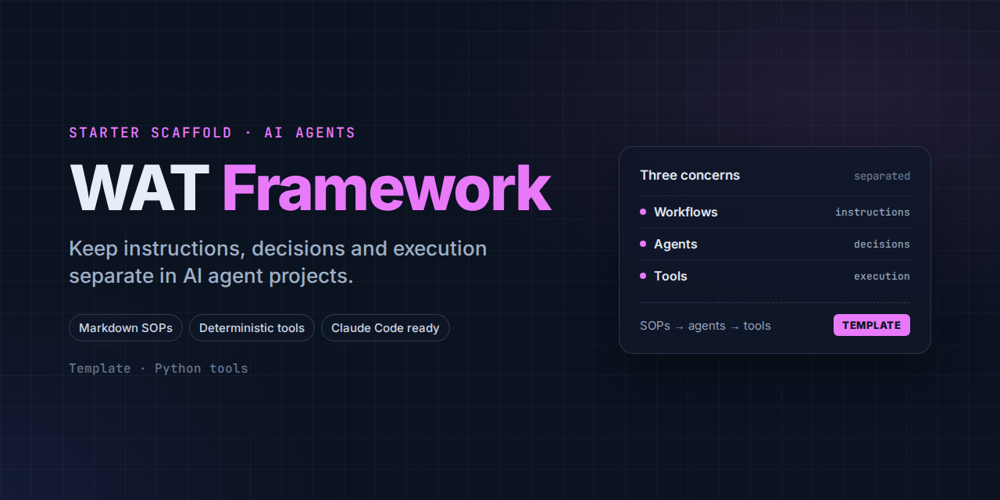

# WAT Framework Template

A minimal starter scaffold for building AI agent projects around three separated concerns:
**Workflows** (instructions), **Agents** (decision-making), and **Tools** (deterministic
execution). See `CLAUDE.md` (or `AGENTS.md` — identical content, different entry point per
AI coding tool) for the full framework explanation and operating rules.

## Why separate these

When an AI agent tries to handle every step of a task directly — reasoning *and* execution —
accuracy compounds downward fast: at 90% accuracy per step, five sequential steps only
succeed 59% of the time. Offloading execution to deterministic, testable scripts keeps the
agent focused on orchestration and judgment calls, where it's actually reliable.

## Layout

```
workflows/      Markdown SOPs — objective, required inputs, which tools to use, expected
                 outputs, edge cases. Written like you're briefing a teammate.
tools/          Python scripts that do the actual work (API calls, data transforms, file
                 ops). Consistent, testable, fast.
.tmp/           Disposable intermediate/scraped files. Regenerated as needed, gitignored.
.env.example    Template for API keys and secrets. Copy to .env (gitignored) and fill in.
CLAUDE.md       Agent operating instructions (Claude Code)
AGENTS.md       Same content, generic entry point for other AI coding tools
```

## Getting started

1. Copy this template into a new project folder.
2. `cp .env.example .env` and fill in whatever credentials your project's tools will need.
3. Write your first workflow in `workflows/` describing what you want done.
4. Point your agent at `CLAUDE.md`/`AGENTS.md` and let it build the first tool script to
   match.

Both `tools/` and `workflows/` start empty (a `.gitkeep` each) — this is a scaffold, not a
finished project.
